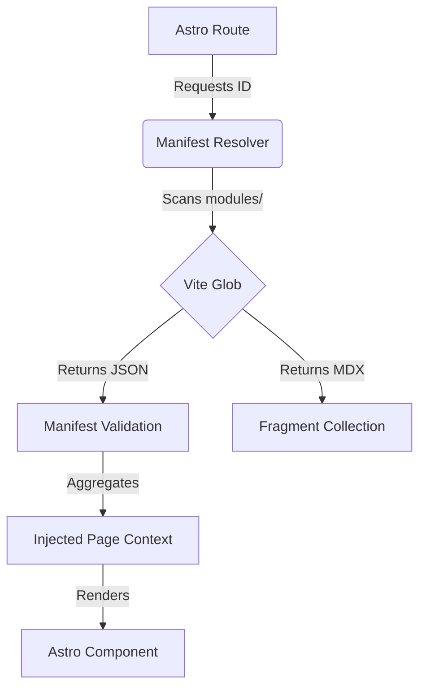

# 🏛️ CS Skillbuilder: High-Level Technical Architecture

## 1. Core Paradigm: Knowledge as a Plugin
The system rejects the traditional "Static Site" model where content and logic are coupled. Instead, it operates as a **Headless Knowledge Engine** designed around two distinct domains:

- **The Kernel (src/):** A domain-agnostic rendering engine. It handles routing, theme synchronization, search indexing, and provides a global "Standard Library" of React components.
- **The Knowledge Graph (modules/):** A collection of hot-swappable plugins. Each Subject and Lesson is treated as an autonomous package containing its own data, content, and tools.

## 2. Directory Topology

```text
/
├── config/                # Tooling Infrastructure (Linter, Tailwind, TS Proxy)
├── docs/                  # Engineering specifications and Master Plans
├── modules/               # THE PLUGINS (Headless Knowledge Base)
│   └── [category]/
│       └── [subject]/     # Bounded Context
│           └── [lesson]/  # Atomic Autonomous Unit (AAU)
└── src/                   # THE KERNEL (Rendering Engine)
    ├── components/        # React Islands (Shared & System logic)
    ├── core/              # Functional Core (Domain Types, Resolvers, Progress)
    ├── layouts/           # Global Page Templates
    └── pages/             # Astro Routing Orchestrator
```

## 3. The AAU (Atomic Autonomous Unit) Pattern
A lesson is the smallest unit of deployment. To ensure horizontal scalability and prevent "Mud Ball" architecture, every lesson folder must be self-contained:

1. **manifest.json:** The contract. Defines fragments, metadata, and required tools.
2. **fragments/:** MDX content units restricted to max 100 lines for cognitive ease.
3. **local_simulators/:** Specialized React tools used exclusively by that lesson.

## 4. Manifest Orchestration Flow
The system resolves content through a hierarchical crawling process implemented in the `manifest-resolver.ts`:



## 5. Technical Decision Log

### 5.1. Registry-Based Component Injection
MDX files are forbidden from using `import` statements. The Kernel uses a **Registry Pattern** to discover local simulators and inject them into the MDX execution context at runtime based on the manifest definitions.

### 5.2. Cross-Island State Synchronization
Progress tracking (completion toggles, reading progress) is synchronized across disconnected React islands (Sidebars, Content, Cards) via a **Global Event Bus** triggered by `localStorage` updates.

### 5.3. Subpath Deployment Resolution
The system uses a `resolvePath` utility to handle GitHub Pages subpath deployment. This ensures that every internal link is environment-aware, preventing 404s when the application is hosted at `/LearnCS/` instead of the root.

### 5.4. Strict Singleton React
Astro's island architecture is prone to "Invalid Hook Call" errors if multiple React instances exist. We enforce a **Singleton Resolution** via dependency overrides in `package.json` and Vite deduplication in `astro.config.mjs`.

## 6. Development Lifecycle
- **Refactoring:** Follow the **Boy Scout Rule** (always leave code cleaner).
- **Complexity:** Max 100 lines per file; max 2 positional parameters per function.
- **Verification:** Every logical tool must have a co-located `__tests__` directory for auto-discovery.
