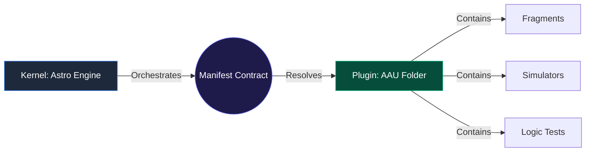

# 🏗️ Radical Decoupling: Kernel vs. Plugins (AAU)

This project implements a strict Microkernel architecture. We treat Computer Science knowledge not as a "website," but as a series of **Hot-Swappable Plugins** orchestrated by a domain-agnostic engine.

## 1. The AAU (Atomic Autonomous Unit) Mandate

Every lesson is an **AAU**. This is the highest level of decoupling achieved in the system. 

**Why?**
Standard architectures scatter logic (React components in `/src`), content (MDX in `/content`), and data (JSON in `/data`). This creates "High Coupling": deleting a lesson requires hunting files across the entire repository. 

**The AAU Solution:**
Everything required to teach a specific concept—the text (MDX), the interactive tool (React), the tests (Vitest), and the metadata (JSON)—lives in a single, self-contained directory.

```text
/modules/subject/lesson/  <-- THE BOUNDARY
├── manifest.json         # Orchestration logic
├── fragments/            # Content units
└── local_simulators/     # Domain-specific tools
```

## 2. The Registry Pattern: Zero-Import Content

To prevent content files (MDX) from being coupled to specific filesystem paths, we enforce a **Zero-Import Rule**.

- **Prohibition:** MDX files must never use `import MyComponent from '../../...'`.
- **Mechanism:** The Kernel (Engine) uses `import.meta.glob` to scan the AAU folder, builds a component registry, and injects it into the MDX execution context at runtime.
- **Benefit:** MDX remains pure Markdown. If you move the lesson folder, the references don't break because the Kernel resolves them dynamically based on the current context.

## 3. The Promotion Rule (Scalability Strategy)

To prevent the "Batiburrillo" (a messy mixture) of components, we follow a strict hierarchy for code reuse. We prioritize **Decoupling over Reuse**.

1.  **Local (The Default):** Every tool starts inside an AAU's `local_simulators/` folder. It is invisible to other lessons.
2.  **Shared (Subject Level):** If a tool is needed by multiple lessons in the *same* subject, it is promoted to `_shared_simulators/` within that subject folder.
3.  **Global (Kernel Level):** Only when a component is proven to be a universal engineering utility (e.g., a bit-voter, a code-editor) is it promoted to `src/components/shared-engineering/`.

## 4. Logical Sovereignty: Functional Core

Even within a "Plugin" (AAU), we decouple logic from presentation:
- **Functional Core:** The mathematical or logical engine of a simulator must be a pure `.ts` file with 0% dependency on React or the DOM.
- **Imperative Shell:** The `.tsx` file is merely a wrapper that handles state and rendering.

## 5. Architectural Flow



## 6. The "Orphan" Test
The success of our decoupling strategy is measured by the **Orphan Test**: 
> "If I run `rm -rf modules/hardware/cpu-logic`, does the system still build, and is there any dead code left in `/src`?"

If the answer is **Yes**, the strategy has been successful. The Kernel remains a clean, reusable engine for any knowledge domain.
