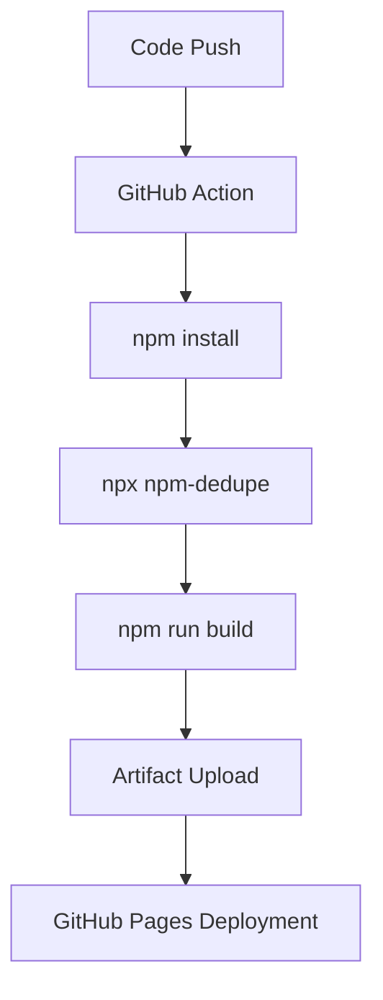

# 🚀 Deployment and Subpath Integrity

The CS Skillbuilder is optimized for **GitHub Pages** and static environments. Due to its architecture as a Headless Knowledge Engine, it requires specific routing and dependency handling to maintain integrity across environments.

## 1. Subpath Deployment Resolution

GitHub Pages hosts the application at a subdirectory (e.g., `https://raulcv7-hub.github.io/LearnCS/`). Standard absolute paths (starting with `/`) will break because they point to the domain root instead of the repository root.

### 1.1. The resolvePath Utility
The system uses a centralized utility in `src/core/utils/path-utils.ts` to wrap every internal URL. 

- **Strategy:** It strips existing slashes and joins the `import.meta.env.BASE_URL` with the target route.
- **Reentrancy Guard:** The utility detects if a path already contains the base prefix to prevent recursive errors like `/LearnCS/LearnCS/subject/...`.

### 1.2. Configuration Contract
In `astro.config.mjs`, the `base` property must be strictly defined with leading and trailing slashes:
```javascript
export default defineConfig({
  base: '/LearnCS/',
  // ... rest of config
});
```

## 2. The React Singleton Problem

Astro bundles React islands separately. If multiple physical copies of React exist in the `node_modules` tree, React Hooks will throw an **"Invalid Hook Call"** error during hydration.

### 2.1. Dependency Deduplication
The build pipeline must enforce a singleton resolution. This is achieved via two mechanisms:
1.  **Package Overrides:** Forces a specific React version in `package.json`.
2.  **Vite Dedupe:** Configured in `astro.config.mjs` to ensure the bundler only uses one reference.

## 3. Build and Deployment Pipeline

The production build follows a strict sequential flow to ensure environment stability.



### 3.1. Standard Deployment Commands
```bash
# 1. Clean and install
npm install

# 2. Prevent Hook errors
npm dedupe

# 3. Static Site Generation
npm run build
```

## 4. Environment-Aware Routing

All internal links in React components and Astro pages must follow the **Path Resolution Protocol**:

- **Prohibited:** `<a href="/subject/logic">`
- **Mandatory:** `<a href={resolvePath('/subject/logic')}>`

This ensures that the application remains fully functional whether it is running on `localhost:4321/` or `raulcv7-hub.github.io/LearnCS/`.

## 5. ViewTransitions and Theme Persistence

While the system uses standard navigation to maintain stability, the theme state (`light`/`dark`) is managed via an **Inline Hydration Script** in the Layout. 
- This script runs before the first paint.
- It ensures that the user's preference is respected even during subpath jumps, preventing the "white flash" on dark mode.
