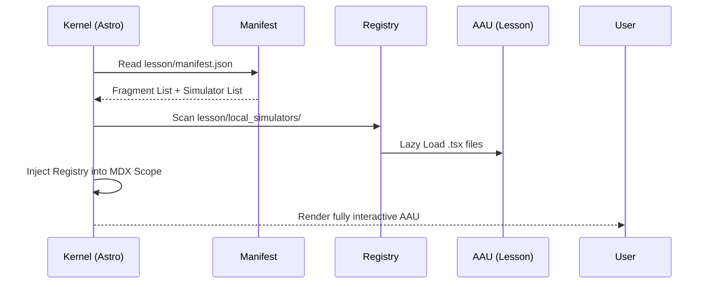

# 📑 Manifest System: The Microkernel Contract

The CS Skillbuilder operates as a **Headless Knowledge Engine**. It rejects hardcoded routes and instead uses a hierarchical manifest system to discover, orchestrate, and render content as hot-swappable plugins.

## 1. The Orchestration Philosophy

The system treats the filesystem as its database. The "Kernel" (Astro engine) is completely unaware of the subject matter; it only understands the **Manifest Contract**. This allows us to scale to thousands of lessons without modifying a single line of core rendering code.

## 2. Subject Manifest Contract
Located at: `/modules/[category]/[subject_id]/manifest.json`

The Subject Manifest defines a **Bounded Context**. It groups related lessons and establishes their pedagogical sequence.

```json
{
  "id": "discrete-math",
  "title": "Discrete Mathematics",
  "type": "foundations",
  "order": 1,
  "description": "Logic and discrete structures.",
  "lessons": ["propositional-logic", "set-theory"]
}
```

- **order**: Defines the display sequence in the Landing Page grid.
- **lessons**: An ordered array of Lesson IDs that establishes the "Previous/Next" navigation flow.

## 3. Lesson Manifest: The AAU Specification
Located at: `/modules/[category]/[subject_id]/[lesson_id]/manifest.json`

Each lesson is an **Atomic Autonomous Unit (AAU)**. It must contain everything it needs to function.

```json
{
  "id": "propositional-logic",
  "title": "Propositional Logic",
  "learningPoints": [
    "Truth tables and logical operators",
    "Propositional equivalence",
    "Normal forms (CNF, DNF)"
  ],
  "fragments": ["01-intro", "02-truth-tables"],
  "simulators": ["TableGenerator"],
  "metadata": {
    "estimatedTime": "20m",
    "difficulty": "easy"
  }
}
```

### 3.1. AAU Components
1. **fragments/**: A subdirectory containing MDX files. Names must match the `fragments` array in the manifest.
2. **local_simulators/**: A subdirectory containing specialized React components.
3. **learningPoints**: High-density bullet points displayed on the subject overview cards.

## 4. The Component Registry (Injection Protocol)

To maintain clean content, MDX fragments **must not** contain import statements. Instead, the system uses a Registry Pattern:

1. **Discovery**: The `manifest-resolver` scans the lesson's `local_simulators/` folder.
2. **Mapping**: It creates a dictionary where the `Key` is the component name and the `Value` is the lazy-loaded React component.
3. **Injection**: The Astro page feeds this dictionary into the MDX Provider.



## 5. Directory Topology for AAU

A compliant AAU must follow this strict structure to be auto-discovered by the Kernel:

```text
lesson-id/
├── manifest.json
├── fragments/
│   ├── 01-intro.mdx
│   └── 02-deep-dive.mdx
└── local_simulators/
    └── LogicGateSim/
        ├── index.tsx
        ├── core-logic.ts
        └── __tests__/
```

## 6. Contract Invariants
- **Atomic Deletion**: Deleting the `lesson-id/` folder must result in zero orphan files in the rest of the project.
- **Isolation**: A fragment in Lesson A cannot reference a simulator in Lesson B. If reuse is needed, the simulator must be promoted to the Subject's `_shared_simulators/` or the Kernel's global library.
- **Max LOC**: Manifests and fragments should not exceed 100 lines to ensure maintainability and LLM context compatibility.
