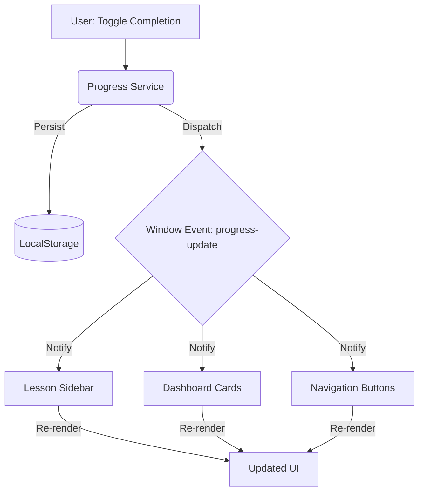

# 💾 Progress Tracking: Cross-Island Synchronization

The Skillbuilder tracks user progress at two levels: **Fragment Interaction** (reading state) and **Lesson Completion** (manual commitment). Because we use Astro's Island Architecture, state must be synchronized across disconnected React components without a heavy global state manager.

## 1. The Global Event Bus Strategy

To ensure that clicking "Mark as Complete" in a lesson instantly updates the Sidebar and the Dashboard Cards, we use a **Native Event Bus** tied to `localStorage`.

1.  **Write Phase:** The `progress-service.ts` updates `localStorage`.
2.  **Broadcast Phase:** It dispatches a custom `progress-update` window event.
3.  **Sync Phase:** All active React islands listen for this event and trigger a local state refresh.



## 2. Storage Schema (v3)

Progress is stored under the key `skillbuilder_v3_progress`. The schema is designed for O(1) lookups.

```typescript
interface ProgressState {
  // Array of Lesson IDs fully completed by the user
  completedLessons: string[];
  
  // Record of fragments seen/read within each lesson
  // Key: lessonId, Value: array of fragmentIds
  completedFragments: Record<string, string[]>;
}
```

## 3. Completion Logic Hierarchies

### 3.1. Manual Completion (The Commitment)
The user explicitly clicks "Complete Lesson" at the bottom of a module. This is the authoritative state used to calculate Subject progress and trigger the "Mastery Achieved" (Green Glow) state on the dashboard.

### 3.2. Fragment Tracking (The Reading Path)
As the user scrolls, the `TableOfContents` component uses an `IntersectionObserver` (or scroll listener) to detect which fragments have been reached.
- These are stored in `completedFragments`.
- They are used to highlight the TOC items in emerald, providing visual feedback of the "reading path."

## 4. The "Mastery Achieved" State

A Subject is considered **Perfected** when:
`lessons.length === progressService.calculateSubjectProgress(subject.lessons)`

When this condition is met, the `SubjectCard` component:
1.  Switches its accent color from the Domain color to **Emerald**.
2.  Displays a "Mastery Achieved" badge.
3.  Applies a subtle shadow glow to indicate 100% completion.

## 5. Hydration & FOUC Prevention

To prevent "Flash of Unstyled Content" or incorrect progress states during initial load:
- Components use `useEffect` to read from `localStorage` only on the client-side.
- Placeholder skeletons or "Default (Uncompleted)" states are rendered on the server to ensure fast TTL (Time to Link).

## 6. Implementation Invariants
- **Privacy**: No user data is ever sent to a server. 100% of progress logic is local.
- **Robustness**: The `getProgress()` utility must handle malformed JSON in `localStorage` by returning a default empty state instead of crashing the island.
- **Sync**: Components must also listen to the native `storage` event to support synchronization across multiple browser tabs.
